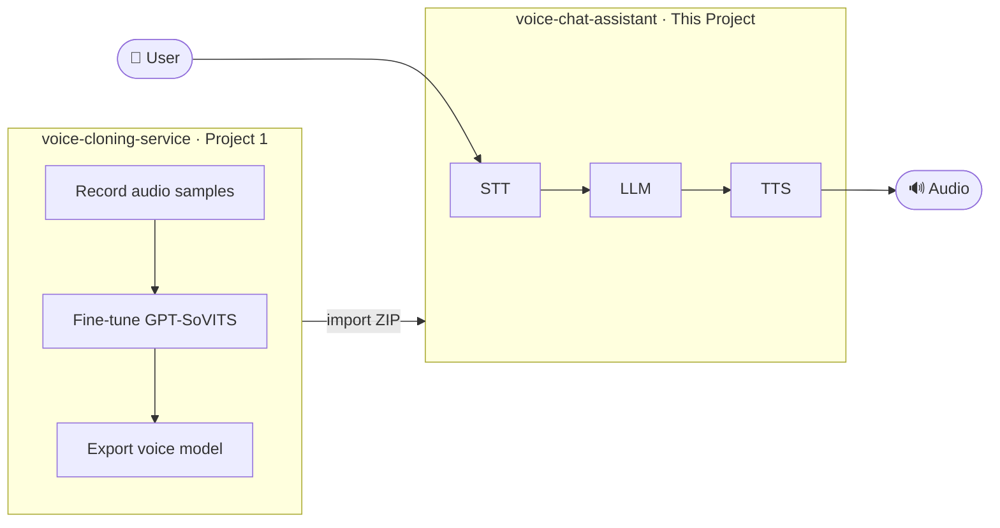
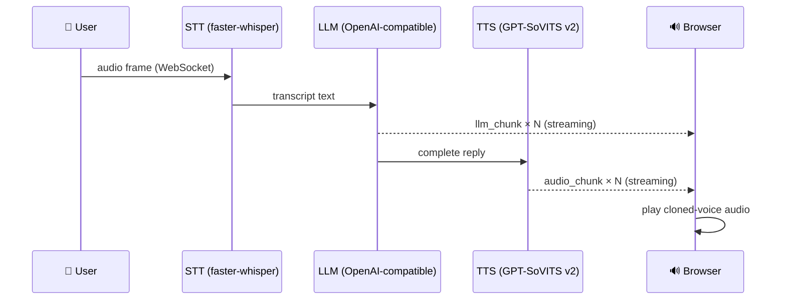

# Voice Chat Assistant

[中文](README.zh.md) | **English**

> A real-time voice conversation web application powered by GPT-SoVITS cloned voices — part two of the voice-cloning pipeline.


---

## Overview

This project is the **second stage** of a two-project voice-cloning system.



**Per-turn pipeline:**



---

## Features

- **Voice-cloned TTS** — uses GPT-SoVITS v2 models trained in Project 1; LRU cache holds up to 3 models in VRAM
- **Sentence-level streaming TTS** — LLM output split at punctuation boundaries; each sentence is synthesized and played immediately, reducing first-audio latency
- **Ordered audio queue** — browser plays TTS chunks in sequence (no overlap) using a Promise-based drain loop keyed by `seq` index
- **Real-time waveform** — live 5-bar mountain-shaped waveform on the record button, driven by `AnalyserNode` at 60 fps
- **Real-time STT** — faster-whisper `medium` on CUDA, streams transcript back over WebSocket
- **Streaming LLM** — any OpenAI-compatible endpoint; mock mode when no key is set
- **Full-duplex WebSocket** — audio frames in, transcript + LLM chunks + audio chunks out
- **Auto conversation title** — LLM generates a concise title after the first exchange; updates sidebar instantly via `title_updated` WebSocket event
- **Voice management** — import voices as ZIP, switch active voice per conversation
- **Conversation history** — messages and audio URLs persisted in PostgreSQL
- **JWT authentication** — register / login; password complexity enforced; all resources are user-scoped

---

## Tech Stack

| Layer | Technology |
|-------|-----------|
| Frontend | React 18 · TypeScript · Vite · Tailwind CSS · shadcn/ui |
| Backend | FastAPI · SQLAlchemy (async) · Alembic |
| Database | PostgreSQL 14+ · Redis 7+ |
| STT | faster-whisper (medium, CUDA) |
| LLM | OpenAI-compatible API (mock fallback) |
| TTS | GPT-SoVITS v2 (from Project 1) |
| Transport | WebSocket (full-duplex) |
| DevOps | Docker Compose · Conda · Nginx |

---

## Prerequisites

| Requirement | Version |
|------------|---------|
| OS | Windows 11 or Ubuntu 20.04/22.04 |
| GPU | NVIDIA RTX (8 GB+ VRAM recommended) |
| CUDA | 12.8+ |
| Conda | Miniconda or Anaconda |
| Docker Desktop | 24+ (for PostgreSQL + Redis) |
| Git | SSH key configured |

---

## Quick Start

### 1. Clone the repository

```bash
git clone git@github.com:lvzhuojun/voice-chat-assistant.git
cd voice-chat-assistant
```

### 2. Create the Conda environment

```bash
# Windows
setup\install.bat

# Or manually
conda env create -f environment.yml
```

### 3. Clone GPT-SoVITS source

```bash
setup\clone_gptsovits.bat
# or: git clone https://github.com/RVC-Boss/GPT-SoVITS.git GPT-SoVITS
```

### 4. Download pretrained models

```bash
conda activate voice-chat
python setup/download_models.py
```

> **Shortcut:** if you have already run Project 1, copy from there:
> ```bash
> cp -r ../voice-cloning-service/storage/pretrained_models/GPT-SoVITS/ \
>        storage/pretrained_models/GPT-SoVITS/
> ```

### 5. Configure environment variables

```bash
cp .env.example .env
# Edit .env — at minimum set JWT_SECRET_KEY and DATABASE_URL
```

Key variables:

| Variable | Description | Required |
|----------|-------------|----------|
| `DATABASE_URL` | PostgreSQL connection string | Yes |
| `JWT_SECRET_KEY` | Random secret (≥ 32 chars) | Yes |
| `LLM_API_KEY` | OpenAI-compatible key | No (mock if empty) |
| `LLM_BASE_URL` | LLM endpoint | No |
| `WHISPER_MODEL_SIZE` | `tiny` / `medium` / `large` | No (default: `medium`) |
| `CORS_ORIGINS` | Extra allowed origins (comma-separated) | No |
| `MAX_UPLOAD_SIZE_MB` | Voice ZIP upload size limit | No (default: `500`) |

### 6. Start all services

```bash
# Windows — bat (cmd)
start.bat

# Windows — PowerShell
.\start.ps1
```

The script starts Docker (PostgreSQL + Redis), runs Alembic migrations, then launches the backend and frontend in separate windows.

Open **http://localhost:5173** in your browser.

### Stop services

```bash
stop.bat   # or .\stop.ps1
```

---

## Directory Structure

```
voice-chat-assistant/
├── backend/                # FastAPI application
│   ├── api/                # Route handlers (auth, voices, conversations, ws)
│   ├── models/             # SQLAlchemy ORM models
│   ├── services/           # STT / LLM / TTS engine wrappers
│   ├── alembic/            # Database migrations
│   └── main.py
├── frontend/               # React + Vite application
│   └── src/
│       ├── components/     # UI components
│       ├── pages/          # Route pages
│       └── stores/         # Zustand state
├── docker/                 # Docker Compose + Nginx config
├── setup/                  # Installation scripts
├── docs/                   # Documentation
│   ├── API.md
│   ├── DEPLOY.md
│   └── VOICE_MODEL_IMPORT.md
├── storage/                # Runtime data (gitignored)
│   ├── voice_models/       # Imported voice model files
│   └── pretrained_models/  # GPT-SoVITS pretrained weights
├── start.bat / start.ps1   # Windows startup scripts
├── stop.bat  / stop.ps1    # Windows stop scripts
└── environment.yml         # Conda environment definition
```

---

## Importing a Voice Model

After training a voice in Project 1, export a ZIP and upload it through the web UI:

1. In `voice-cloning-service`, compress the model folder:
   ```powershell
   # PowerShell
   Compress-Archive -Path "storage/models/$VOICE_ID/*" -DestinationPath "$VOICE_ID.zip"
   ```
2. Open voice-chat-assistant → **Voice Management** → drag and drop the ZIP.
3. Select the voice in a conversation.

See [docs/VOICE_MODEL_IMPORT.md](docs/VOICE_MODEL_IMPORT.md) for the full guide.

---

## Documentation

| Document | Description |
|----------|-------------|
| [docs/API.md](docs/API.md) | REST API and WebSocket reference |
| [docs/DEPLOY.md](docs/DEPLOY.md) | Production deployment on Linux |
| [docs/VOICE_MODEL_IMPORT.md](docs/VOICE_MODEL_IMPORT.md) | How to import GPT-SoVITS voices |
| [ARCHITECTURE.md](ARCHITECTURE.md) | System architecture diagrams |

---

## Related Project

[voice-cloning-service](https://github.com/lvzhuojun/voice-cloning-service) — Project 1: record audio samples and fine-tune a GPT-SoVITS voice model.

---

## License

MIT © lvzhuojun
