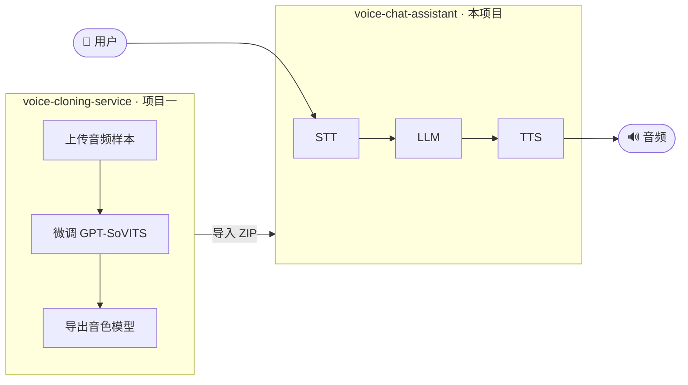
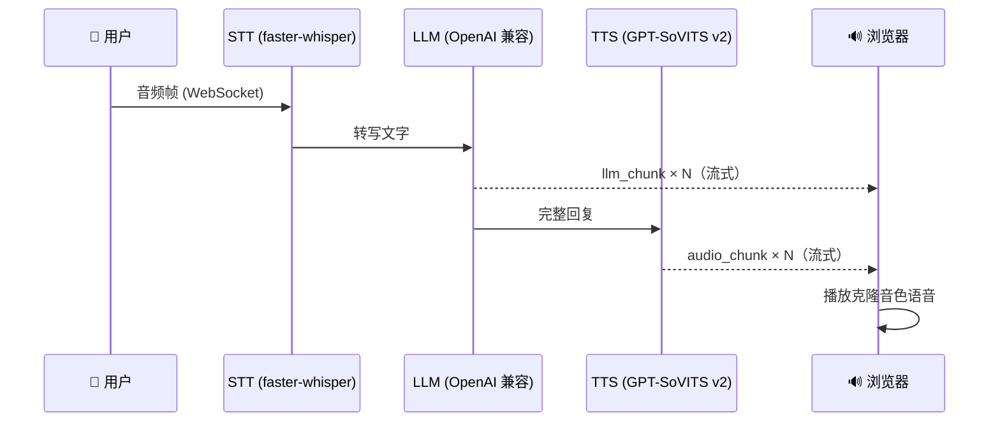

# Voice Chat Assistant

**中文** | [English](README.md)

> 基于 GPT-SoVITS 克隆音色的实时语音对话 Web 应用——语音克隆流水线的第二阶段。


---

## 项目简介

本项目是两项目语音克隆系统的**第二阶段**。



**单轮对话流程：**



---

## 功能特性

- **克隆音色 TTS** — 使用项目一训练的 GPT-SoVITS v2 模型；LRU 缓存最多在 VRAM 中保留 3 个模型
- **句级流式 TTS** — LLM 输出按标点边界切句，每句立即合成并推送，大幅降低首帧音频延迟
- **有序音频队列** — 浏览器通过 Promise 串行播放 TTS 分块（按 `seq` 序号），无重叠、无错序
- **实时波形动画** — 录音按钮显示 5 根山形波形柱，由 `AnalyserNode` 以 60 fps 驱动
- **实时 STT** — faster-whisper `medium`，CUDA 加速，转写结果通过 WebSocket 实时返回
- **流式 LLM** — 支持任意 OpenAI 兼容接口；未配置 Key 时自动进入 mock 模式
- **全双工 WebSocket** — 音频帧输入，转写文字 + LLM 分块 + 音频块同步输出
- **VAD 自动停止录音** — 静音检测（1.5 秒），说完话自动停止录音，无需一直按住按钮
- **移动端响应式布局** — 手机上侧边栏变为滑入抽屉，汉堡菜单控制，触控友好间距
- **对话标题自动生成** — 首轮对话结束后 LLM 自动生成简洁标题，通过 `title_updated` WebSocket 事件实时更新侧边栏
- **音色管理** — ZIP 包导入音色，每个对话可独立切换当前音色
- **对话历史** — 消息和音频 URL 持久化到 PostgreSQL
- **JWT 认证** — 注册 / 登录，密码强度校验，所有资源均按用户隔离

---

## 技术栈

| 层 | 技术 |
|----|------|
| 前端 | React 18 · TypeScript · Vite · Tailwind CSS · shadcn/ui |
| 后端 | FastAPI · SQLAlchemy（异步）· Alembic |
| 数据库 | PostgreSQL 14+ · Redis 7+ |
| STT | faster-whisper（medium，CUDA） |
| LLM | OpenAI 兼容接口（mock 兜底） |
| TTS | GPT-SoVITS v2（来自项目一） |
| 通信 | WebSocket（全双工） |
| 运维 | Docker Compose · Conda · Nginx |

---

## 环境要求

| 要求 | 版本 |
|------|------|
| 操作系统 | Windows 11 或 Ubuntu 20.04/22.04 |
| GPU | NVIDIA RTX（建议 8 GB+ VRAM） |
| CUDA | 12.8+ |
| Conda | Miniconda 或 Anaconda |
| Docker Desktop | 24+（用于 PostgreSQL + Redis） |
| Git | 已配置 SSH Key |

---

## 快速开始

### 1. 克隆仓库

```bash
git clone git@github.com:lvzhuojun/voice-chat-assistant.git
cd voice-chat-assistant
```

### 2. 创建 Conda 环境

```bash
# Windows
setup\install.bat

# 或手动
conda env create -f environment.yml
```

### 3. 克隆 GPT-SoVITS 源码

```bash
setup\clone_gptsovits.bat
# 或：git clone https://github.com/RVC-Boss/GPT-SoVITS.git GPT-SoVITS
```

### 4. 下载预训练模型

```bash
conda activate voice-chat
python setup/download_models.py
```

> **捷径：** 如果已经运行过项目一，可直接复制：
> ```bash
> cp -r ../voice-cloning-service/storage/pretrained_models/GPT-SoVITS/ \
>        storage/pretrained_models/GPT-SoVITS/
> ```

### 5. 配置环境变量

```bash
cp .env.example .env
# 编辑 .env，至少填写 JWT_SECRET_KEY 和 DATABASE_URL
```

关键配置项：

| 变量 | 说明 | 是否必填 |
|------|------|---------|
| `DATABASE_URL` | PostgreSQL 连接字符串 | 必填 |
| `JWT_SECRET_KEY` | 随机密钥（≥ 32 字符） | 必填 |
| `LLM_API_KEY` | OpenAI 兼容 API Key | 否（为空则 mock） |
| `LLM_BASE_URL` | LLM 接口地址 | 否 |
| `WHISPER_MODEL_SIZE` | `tiny` / `medium` / `large` | 否（默认 `medium`） |
| `CORS_ORIGINS` | 额外允许的跨域来源（逗号分隔） | 否 |
| `MAX_UPLOAD_SIZE_MB` | 音色 ZIP 上传大小限制 | 否（默认 `500`） |
| `POSTGRES_PASSWORD` | PostgreSQL 密码（Docker Compose） | 否（开发默认值） |
| `REDIS_PASSWORD` | Redis 认证密码（生产环境） | 否 |

### 6. 启动所有服务

```bash
# Windows — bat（cmd）
start.bat

# Windows — PowerShell
.\start.ps1
```

脚本会依次：启动 Docker（PostgreSQL + Redis）→ 执行 Alembic 迁移 → 在独立窗口启动后端和前端。

浏览器打开 **http://localhost:5173**。

### 停止服务

```bash
stop.bat   # 或 .\stop.ps1
```

---

## 目录结构

```
voice-chat-assistant/
├── backend/                # FastAPI 应用
│   ├── api/                # 路由处理器（auth / voices / conversations / ws）
│   ├── models/             # SQLAlchemy ORM 模型
│   ├── services/           # STT / LLM / TTS 引擎封装
│   ├── alembic/            # 数据库迁移脚本
│   └── main.py
├── frontend/               # React + Vite 应用
│   └── src/
│       ├── components/     # UI 组件
│       ├── pages/          # 路由页面
│       └── stores/         # Zustand 状态管理
├── docker/                 # Docker Compose + Nginx 配置
├── setup/                  # 安装脚本
├── docs/                   # 文档
│   ├── API.md
│   ├── DEPLOY.md
│   └── VOICE_MODEL_IMPORT.md
├── storage/                # 运行时数据（已 gitignore）
│   ├── voice_models/       # 导入的音色模型文件
│   └── pretrained_models/  # GPT-SoVITS 预训练权重
├── start.bat / start.ps1   # Windows 启动脚本
├── stop.bat  / stop.ps1    # Windows 停止脚本
└── environment.yml         # Conda 环境定义
```

---

## 导入音色

在项目一训练好音色后，打包为 ZIP 并通过 Web 界面上传：

1. 在 `voice-cloning-service` 目录打包：
   ```powershell
   # PowerShell
   Compress-Archive -Path "storage/models/$VOICE_ID/*" -DestinationPath "$VOICE_ID.zip"
   ```
2. 打开 voice-chat-assistant → **音色管理** → 拖拽 ZIP 文件上传。
3. 在对话中选择该音色。

详细步骤见 [docs/VOICE_MODEL_IMPORT.md](docs/VOICE_MODEL_IMPORT.md)。

---

## 文档

| 文档 | 说明 |
|------|------|
| [docs/API.md](docs/API.md) | REST API 与 WebSocket 接口参考 |
| [docs/DEPLOY.md](docs/DEPLOY.md) | Linux 生产环境部署指南 |
| [docs/VOICE_MODEL_IMPORT.md](docs/VOICE_MODEL_IMPORT.md) | GPT-SoVITS 音色导入指南 |
| [ARCHITECTURE.md](ARCHITECTURE.md) | 系统架构图 |

---

## 关联项目

[voice-cloning-service](https://github.com/lvzhuojun/voice-cloning-service) — 项目一：录制音频样本并微调 GPT-SoVITS 音色模型。

---

## 开源协议

MIT © lvzhuojun
